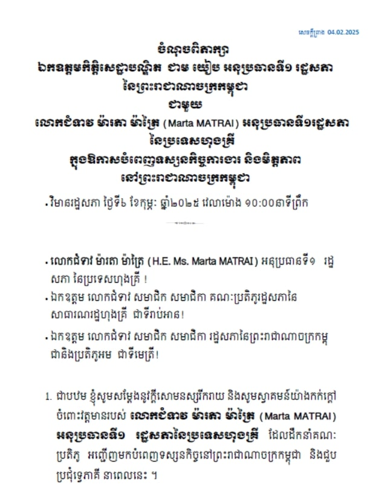
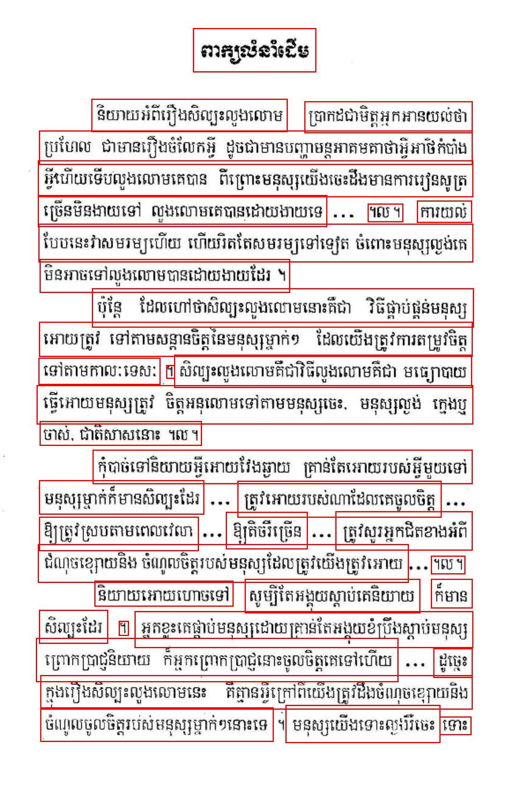

## CRAFT Text Detection

A minimal project for running [CRAFT](https://github.com/clovaai/CRAFT-pytorch) model.

<table>
<tr>
<td>

</td>
<td>

</td>
</tr>
</table>

> Photo was downloaded from https://www.facebook.com/photo/?fbid=4508911212666640&set=pcb.4508913299333098

### Usage

```shell
python3 -m venv venv
source ./venv/bin/activate

pip install -r requirements.txt
```

```shell
python3 detection.py
```

### Reference

- https://github.com/clovaai/CRAFT-pytorch
- https://github.com/JaidedAI/EasyOCR