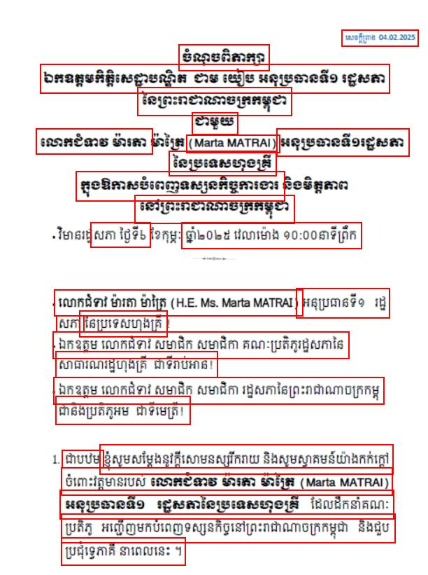

## CRAFT Text Detection

A minimal project for running [CRAFT](https://github.com/clovaai/CRAFT-pytorch) model.

<table>
<tr>
<td>

</td>
<td>

</td>
</tr>
</table>

> Photo was downloaded from https://www.facebook.com/photo/?fbid=4508911212666640&set=pcb.4508913299333098

### Usage

```python
image_file = "assets/khmer.jpg"

device = "cpu"

trained_model = "assets/craft_mlt_25k.pth"

net = CRAFT()
net.load_state_dict(copyStateDict(torch.load(trained_model, map_location=device)))
net.eval()

horizontal_list_agg, free_list_agg = read_text(image_file, net)
image = Image.open(image_file)
image_draw = ImageDraw.Draw(image)

for bbox in horizontal_list_agg[0]:
  x_min, x_max, y_min, y_max = bbox
  image_draw.rectangle(((x_min, y_min), (x_max, y_max)), outline="red", width=2)

image.save("assets/khmer_output.jpg")
```

### Reference

- https://github.com/clovaai/CRAFT-pytorch
- https://github.com/JaidedAI/EasyOCR